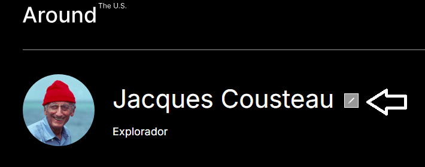
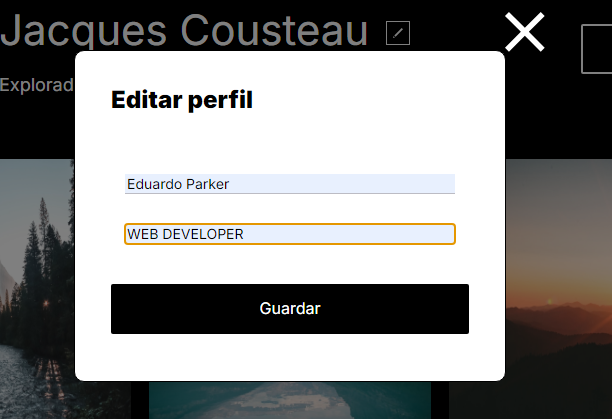
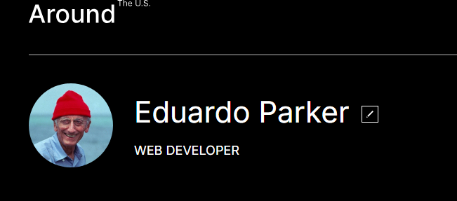
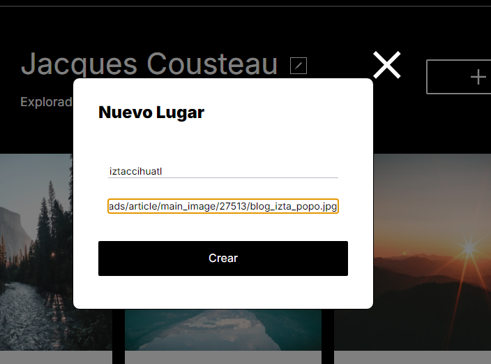
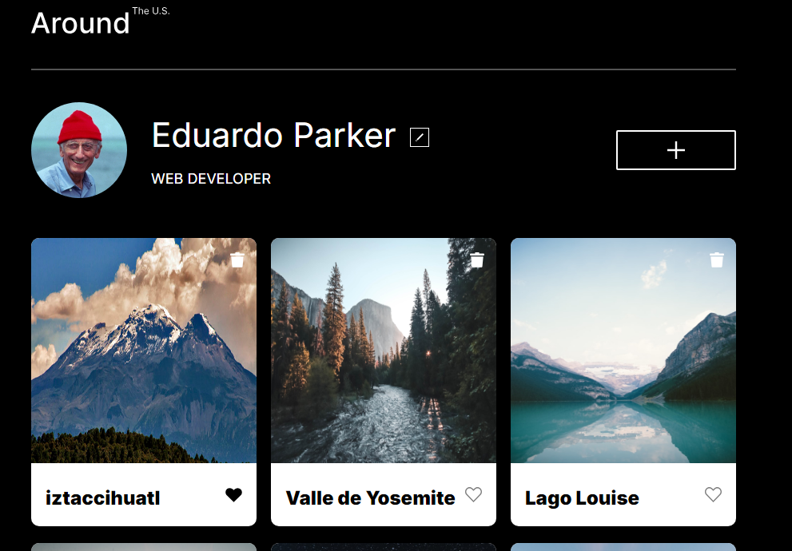
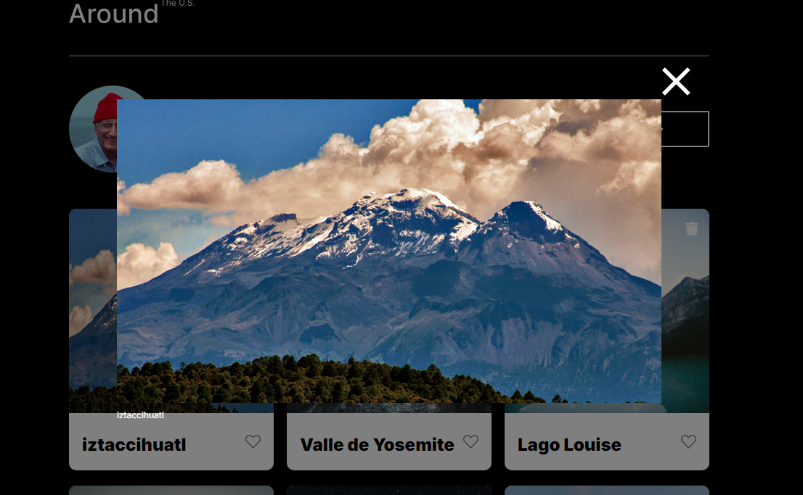

# Tripleten web_project_around

este proyecto muestra una pequeña red social para "exploradores" de estados unidos.
aqui podras compartir y cambiar las mejores fotografias que tomas durante tus fotos, tus amigos podran reaccionar con un like o ver con mejor detalle tus fotos (proximamente).
actualmente al presionar (dar click) el boton para modificar el perfil, sale una ventana emergemte, en donde el usuario puede modificar su nombre y profesion y esta informacion sera mostrada en la ventana principal de esta red social.

en este proyecto se usaron habilidades de html y css avanzadas, como son los forms y el uso de botones, los media queries para hacer el contenido responsivo, asi como el uso de hover para indicar al usiario cuales son los botones que debe de presionar.

se agregan 3 popups, 1 para el formulario del perfil que se abre con el boton de perfil, se cierra con el boton de cerrar y al momento de guardar. los datos agregados en el form se pasan a la pantalla.

el segundo popup es para el formulario de imagenes que se abre con el boton de "+" y se cierra al crear la imagen, los datos ingresados en este form se traducen a nuevas imagenes que se agregan al inicio.
cada imagen cuenta con un boton de like, un boton de eliminar y una descripcion, se pueden interactuar con ambos botones.

por ultimo el popup del Zoom de las imagenes, es zoom permite ver con mas detalle las fotos con la descripcion al pie de cada fotografia.

para agregar las imagenes se uso un template en el HTML, la informacion brindada en el form image, se uso por medio de funciones en JS para agregar casa imagen.

por ultimo les dejo el link para git hub pages y puedan disfrutar de esta red social.
https://eduardoparker.github.io/web_project_around/
